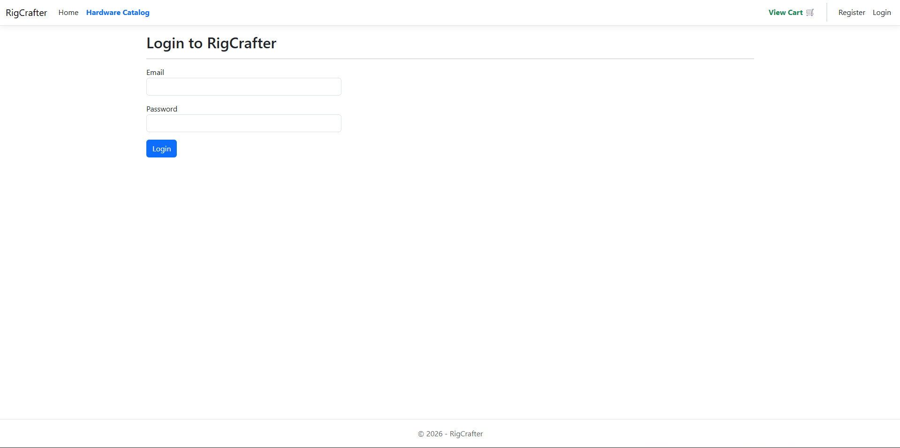
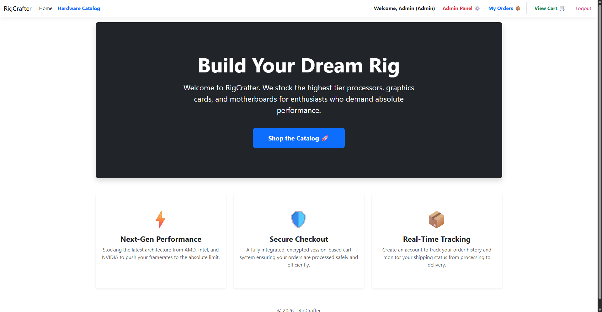
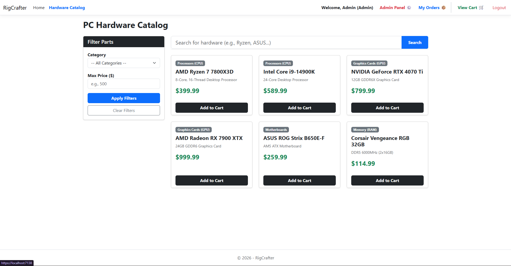
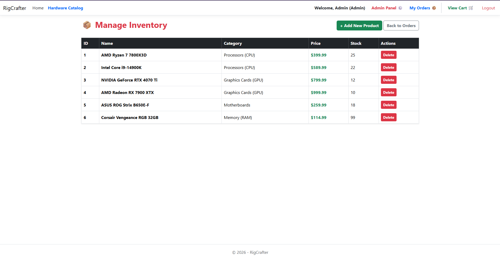
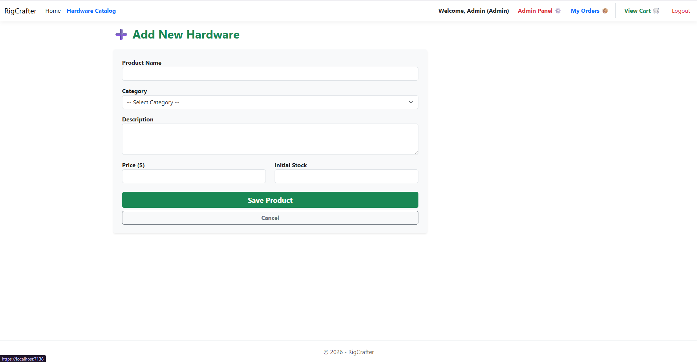
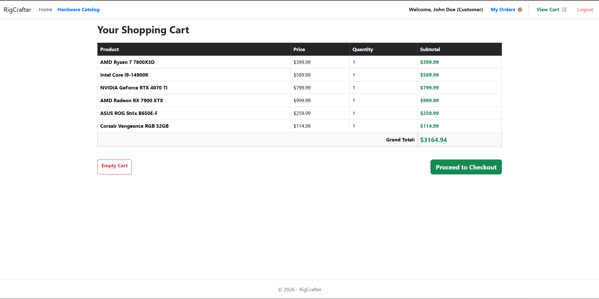
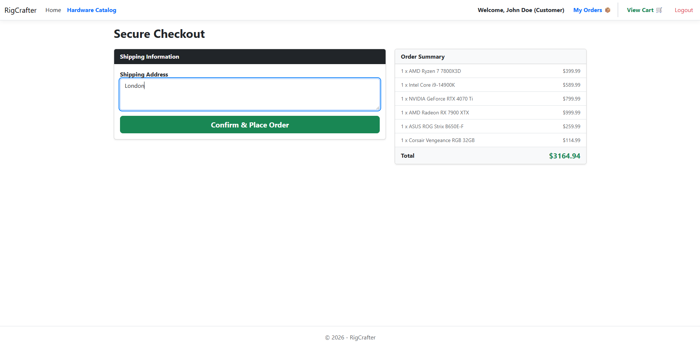
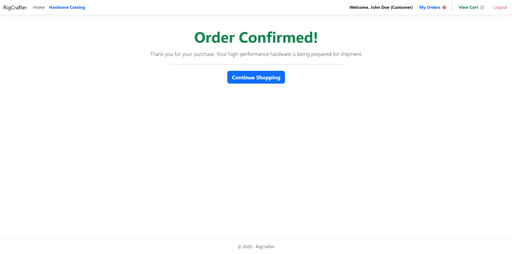
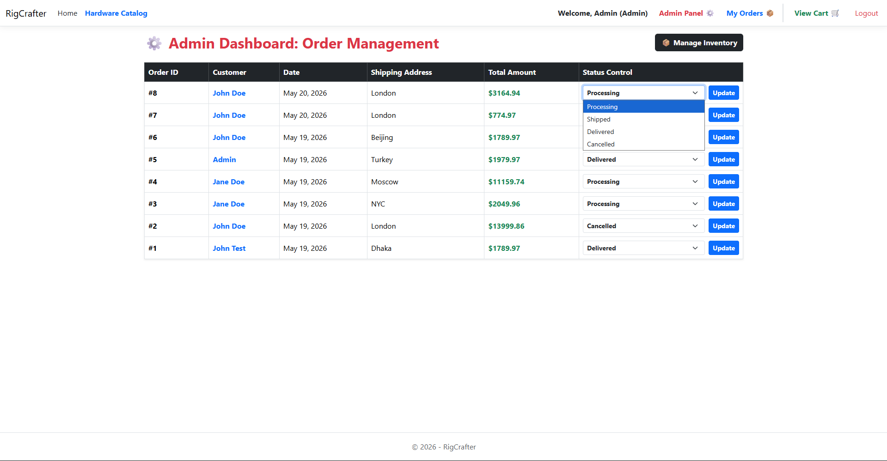
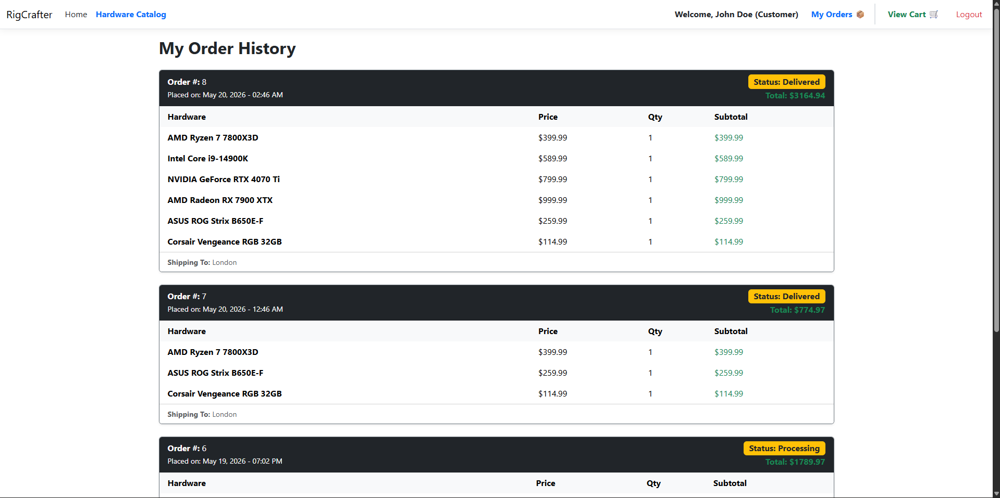

# RigCrafter - PC Hardware E-Commerce Platform

RigCrafter is a full-stack, enterprise-grade e-commerce web application designed for custom PC building enthusiasts. It allows users to browse premium hardware components, manage a session-based shopping cart, and securely check out. It also features a fully authenticated Admin Dashboard for inventory and order lifecycle management.

## 🚀 Tech Stack
* **Framework:** ASP.NET Core MVC (.NET 8)
* **Language:** C#
* **Database:** Microsoft SQL Server
* **ORM:** Entity Framework Core (Database-First Approach)
* **Frontend:** HTML5, CSS3, Bootstrap 5, Razor Syntax

## 🏗️ Architecture (N-Tier Design)
The application strictly follows an N-Tier architecture to ensure a clear separation of concerns, scalability, and security:
* **RigCrafter.DAL (Data Access Layer):** Manages the `DbContext` and Entity models mapping directly to SQL Server tables (Users, Products, Orders, Categories).
* **RigCrafter.BLL (Business Logic Layer):** Houses the core business services (`OrderService`, `ProductService`) and interfaces. It enforces business rules (like pre-checkout stock validation and inventory deduction) and acts as the bridge between the Web and Data layers.
* **RigCrafter.Web (Presentation Layer):** Contains the MVC Controllers and Razor Views. It handles HTTP requests, session state management, and ViewModel mapping while remaining completely abstracted from direct database access.

## ✨ Key Features
* **Role-Based Authorization:** Distinct user experiences and secure routing for 'Customer' and 'Admin' roles.
* **Session State Management:** A persistent shopping cart system utilizing complex object serialization stored securely in user session memory.
* **Dynamic Hardware Catalog:** Filter components by category, search by name/brand, and set maximum price limits.
* **Complex Checkout Validation:** Real-time database queries intercept checkout attempts to prevent over-purchasing out-of-stock items.
* **Admin Command Center:** A secure backend allowing administrators to perform full CRUD operations on inventory and update the shipping statuses of active user orders.

## 📸 Application Gallery

### Security & Authentication

### Platform Interface

